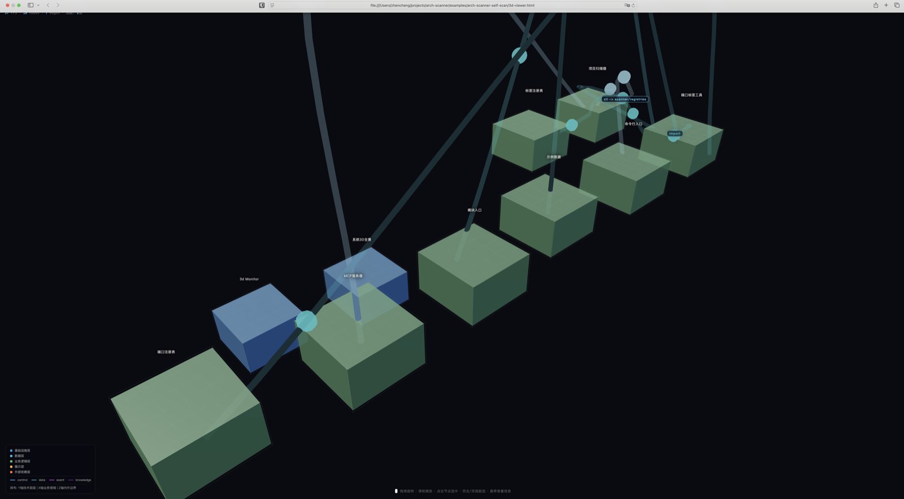

# arch-scanner · 项目架构 3D 可视化工具

<div align="center">

**扫一扫，项目结构一目了然。Agent 能用，不懂技术的人也能看。**



</div>

---

## 这是什么

**arch-scanner** 是一套通过 MCP 协议扫描项目架构并生成 **3D 可视化结构图** 的工具集。

它包含两个组件：

| 组件 | 作用 | 谁在用 |
|------|------|--------|
| **端口标签工具** (port-tag-tool) | 扫描项目目录，自动发现模块、依赖、数据流 | Agent（Hermes、Codex 等） |
| **3D监视器** (3d-monitor) | 把扫描结果渲染成 **3D 结构图**，支持交互操作 | 人（浏览器打开） |

### 核心能力

```
Agent 调用端口标签工具 → 扫描项目 → 数据喂给 3D 监视器 → 生成 3D HTML → 打开即看
```

- **Agent 端**：通过 MCP 协议调用，自动扫描、分析、输出
- **人端**：生成的 3D 页面是**单 HTML 文件**，Three.js 全内联，不装任何依赖，浏览器直接打开

### 适合谁用

- **不懂技术的产品/管理者**：想知道项目长什么样，但看不懂代码
- **AI Agent 使用者**：让 Agent 自动扫描并生成可视化报告
- **开发者**：快速梳理新接手的项目结构

---

## 快速开始

### 1. 安装

```bash
git clone https://github.com/你的用户名/arch-scanner.git
cd arch-scanner
```

两个工具都是纯 Node.js 脚本，无需安装第三方依赖。

### 2. 扫描项目

```bash
node packages/port-tag-tool/cli.js scan --project /你的项目路径
```

### 3. 生成 3D 结构图

```bash
node packages/3d-monitor/mcp-server.js --data-file scan-result.json
```

### 4. 打开看

用浏览器打开生成的 HTML 文件即可。

---

## Agent 接入（MCP 配置）

支持 MCP 协议的 Agent（Hermes、Claude Code、Codex、Cline 等）可以直接调用。

### 配置方法

在 Agent 的 MCP 配置文件中添加：

```json
{
  "mcpServers": {
    "port-tag": {
      "command": "node",
      "args": ["路径/arch-scanner/packages/port-tag-tool/mcp-server.js"]
    },
    "3d-monitor": {
      "command": "node",
      "args": ["路径/arch-scanner/packages/3d-monitor/mcp-server.js"]
    }
  }
}
```

配置后，Agent 可以：
- 调用 `scan_project` 扫描项目
- 调用 `get_tags` / `get_node_ports` 查询模块端口
- 调用 `3d_monitor` 生成可视化 HTML

---

## 项目结构

```
arch-scanner/
├── README.md               ← 本文件
├── LICENSE                 ← MIT 许可证
├── CHANGELOG.md            ← 版本更新记录
├── packages/
│   ├── port-tag-tool/      ← 端口标签工具（扫描引擎）
│   │   ├── mcp-server.js   ← MCP 服务端
│   │   ├── cli.js          ← 命令行入口
│   │   ├── projectScanner.js ← 项目扫描器
│   │   ├── portRegistry.js ← 端口注册表
│   │   └── tagRegistry.js  ← 标签注册表
│   └── 3d-monitor/         ← 3D监视器（展示引擎）
│       ├── viewer.html     ← 3D 展示模板（单文件，内联 Three.js）
│       ├── mcp-server.js   ← MCP 服务端（生成 HTML）
│       └── package.json
├── examples/               ← 使用示例
└── images/                 ← 演示截图
```

## 交互操作

在 3D 结构图中：

| 操作 | 效果 |
|------|------|
| 拖拽旋转 | 任意角度观察 |
| 滚轮缩放 | 拉近拉远 |
| 点击节点 | 选中节点，显示详情面板 |
| 双击空白 | 取消选中（桌面端） |
| 双指点击 | 取消选中（移动端） |
| 详情面板双击节点名 | 切换该节点为当前选中 |
| 详情面板单击节点名 | 高亮该节点连线通路 |
| 空闲15秒 | 摄像机自动环绕旋转 |

## 技术栈

- **Three.js** (r128) — 3D 渲染引擎，全内联在 HTML 中
- **OrbitControls** — 摄像机控制
- **CSS2DRenderer** — 标签渲染
- **MCP 协议** — Agent 工具调用标准接口
- **Node.js** — 工具运行环境

## 许可证

MIT

---

## 赞助支持

如果这个项目对你有帮助，欢迎赞助，支持后续开发维护。


**作者：** Zhencheng · 独立开发者
